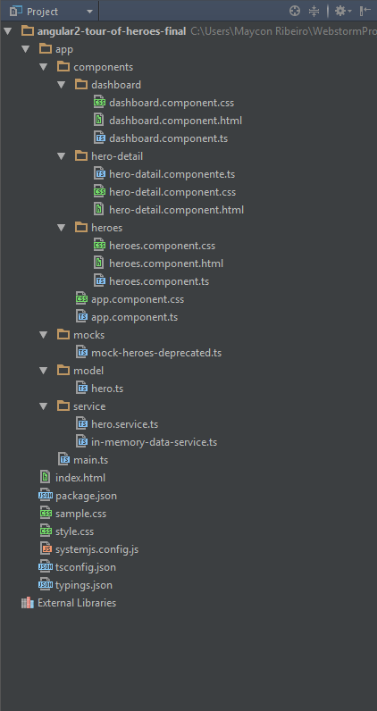

# angular2-tour-of-heroes-final

Projeto completo Angular2, nele estão as novas formas de definir as routers, directives, services e tambem as formas 
de a implementação http no Angular2.

Neste projeto possui as implementações dos metodos http, get, post, put e delete

Novas sintaxes do Angular2 *ngIf e *ngFor e outras.  

E o Typescript como linguagem compilada que gera um .js atraves de meta-programação (Anotações).

# Estrutura
  

# Run App
 *$npm install*
 
 *$npm start*

